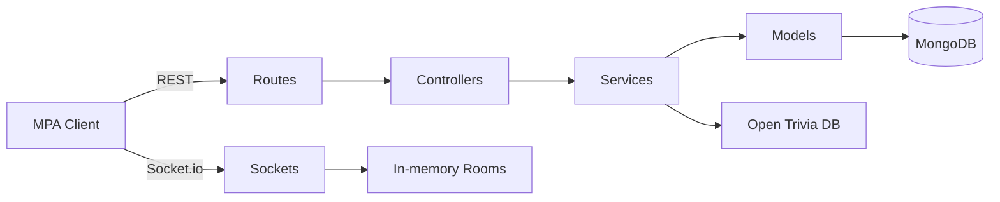

# QuiZapp — Real-Time Multiplayer Quiz Platform

Production-grade full-stack quiz platform with solo play, Socket.io multiplayer rooms, custom quiz creation, JWT auth, Docker, and AWS CI/CD.

**Live link:** _Add your EC2 / domain URL here after deployment_

---

## Architecture

```text
Browser (Multi-page HTML/CSS/JS)
        │  Fetch API (REST)
        │  Socket.io (WebSocket)
        ▼
Express (server/app.js)
   Routes → Controllers → Services → Models → MongoDB
                              ▲
                     Socket handler (rooms, quiz sync)
                              │
                     Open Trivia DB (server-side only)
```



### Request flow (MVC)

`Frontend → Routes → Controllers → Services → Models → MongoDB`

- **Routes** — HTTP paths + validation only  
- **Controllers** — request/response orchestration  
- **Services** — business logic  
- **Models** — Mongoose schemas  

### Why multi-page (not SPA)?

Every major action loads a new HTML page (`lobby.html`, `quiz.html`, etc.). That keeps navigation explicit, simplifies state (sessionStorage between pages), and matches classic MPA deployment on a single Express static host.

### Why Socket.io?

HTTP is request/response. Multiplayer needs the **server to push** events (player joined, next question, leaderboard) to everyone in a room simultaneously. Socket.io provides WebSockets with fallback polling and room broadcasting (`io.to(roomCode).emit(...)`).

### Why JWT + bcrypt?

- **bcrypt** hashes passwords so the database never stores plaintext.  
- **JWT** lets the API stay stateless: the client sends `Authorization: Bearer <token>`; protected routes verify the signature with `JWT_SECRET`.

---

## Features

| Mode | Behavior |
|------|----------|
| **Solo** | Category/difficulty → 15s timer → green/red feedback → results review |
| **Multiplayer** | Create/join room → live lobby → host starts → synced questions → live leaderboard → winner page |
| **Creator** | Authenticated users save custom quizzes to MongoDB |
| **Auth** | Signup/login, profile, quiz history, highest scores |

---

## Project structure

```text
QuiZapp/
├── client/                 # Static MPA frontend
│   ├── css/style.css
│   ├── js/                 # api, utils, socket, page scripts
│   ├── assets/
│   └── pages/              # one HTML file per screen
├── server/
│   ├── config/db.js
│   ├── controllers/
│   ├── middleware/
│   ├── models/
│   ├── routes/
│   ├── services/
│   ├── sockets/socketHandler.js
│   └── app.js
├── server.js
├── Dockerfile
├── docker-compose.yml
├── .github/workflows/deploy.yml
└── package.json
```

---

## API routes

| Method | Path | Auth | Description |
|--------|------|------|-------------|
| POST | `/api/auth/signup` | — | Register |
| POST | `/api/auth/login` | — | Login |
| POST | `/api/auth/forgot-password` | — | Email a time-limited reset link (Resend) |
| POST | `/api/auth/reset-password` | — | Set a new password with reset token |
| GET | `/api/auth/profile` | JWT | Profile + history |
| GET | `/api/quiz/questions` | — | Open Trivia DB or custom `?quizId=` |
| POST | `/api/quiz/create` | JWT | Create custom quiz |
| GET | `/api/quiz/all` | — | List public quizzes |
| GET | `/api/quiz/:id` | — | Quiz by id |
| POST | `/api/quiz/result` | optional | Save score to history |
| POST | `/api/room/create` | — | Create multiplayer room |
| POST | `/api/room/join` | — | Join by code |
| GET | `/api/room/:code` | — | Room snapshot |

### Socket events

| Event | Direction | Purpose |
|-------|-----------|---------|
| `room:join` | C→S | Attach socket to room |
| `room:player-joined` | S→C | Live lobby update |
| `room:start` | C→S / S→C | Host starts; clients navigate |
| `quiz:question` | S→C | Synced question + timer |
| `quiz:answer` | C→S | Submit answer |
| `quiz:result` | S→C | Reveal correct index |
| `quiz:leaderboard` | S→C | Ranked scores |
| `quiz:end` | S→C | Final results |
| `toast` | S→C | UI notifications |

---

## Local setup

### Prerequisites

- Node.js 18+
- MongoDB running locally **or** Docker

### 1. Clone & install

```bash
git clone <your-repo-url>
cd quizapp-real-time-multiplayer-app
cp .env.example .env
npm install
```

### 2. Configure `.env`

```env
PORT=3000
MONGODB_URI=mongodb://localhost:27017/quizapp
JWT_SECRET=your_long_random_secret
JWT_EXPIRES_IN=7d
NODE_ENV=development
CLIENT_ORIGIN=http://localhost:3000
QUESTION_TIME_SECONDS=15
```

Tip: set `MONGODB_URI=memory` to use an ephemeral in-memory MongoDB (requires `mongodb-memory-server` from `npm install`) when you do not have MongoDB or Docker installed.

### 3. Run

```bash
# Terminal A — MongoDB (skip if using MONGODB_URI=memory or Docker)
# mongod

# Terminal B
npm run dev
```

Open [http://localhost:3000/pages/index.html](http://localhost:3000/pages/index.html)

### Docker (app + MongoDB)

```bash
docker compose up --build
```

---

## Deployment guide (AWS EC2)

### 1. Launch EC2

- Ubuntu 22.04 LTS  
- Security group inbound: **22** (SSH), **80**, **443**, **3000** (or terminate TLS at nginx on 80/443 and proxy to 3000)

### 2. Server bootstrap

```bash
sudo apt update && sudo apt install -y docker.io docker-compose-v2 git
sudo usermod -aG docker ubuntu
# log out / back in
```

### 3. Clone app & env

```bash
git clone <your-repo-url> ~/quizapp
cd ~/quizapp
cp .env.example .env
nano .env   # set strong JWT_SECRET and MONGODB_URI if external
```

For compose, `MONGODB_URI=mongodb://mongo:27017/quizapp` is already wired in `docker-compose.yml`.

### 4. First run

```bash
docker compose up -d --build
curl http://127.0.0.1:3000/health
```

Optional: put **nginx** in front for HTTPS (Certbot) and reverse-proxy to `127.0.0.1:3000`.

### 5. CI/CD (GitHub Actions)

Add repository secrets:

| Secret | Example |
|--------|---------|
| `EC2_HOST` | `3.x.x.x` |
| `EC2_USER` | `ubuntu` |
| `EC2_SSH_KEY` | private key PEM |
| `EC2_APP_PATH` | `/home/ubuntu/quizapp` |

Push to `main` → workflow SSHs in, pulls, rebuilds the Docker image, and restarts the app container (Mongo volume stays up for near–zero-downtime data continuity).

### PM2 alternative (without Docker)

```bash
npm ci --omit=dev
pm2 start server.js --name quizapp
pm2 save
```

---

## Page map

| Page | Role |
|------|------|
| `index.html` | Enter name, choose Solo / Create / Join |
| `solo-category.html` | Category & difficulty |
| `solo-quiz.html` | Active solo quiz |
| `solo-result.html` | Score + review |
| `create-room.html` | Host creates room |
| `join-room.html` | Join with code |
| `lobby.html` | Real-time waiting room |
| `quiz.html` | Synced multiplayer quiz |
| `leaderboard.html` | Final rankings |
| `creator.html` | Custom quiz form |
| `login.html` / `signup.html` | Auth |
| `forgot-password.html` | Request reset email |
| `reset-password.html` | Set new password from email link |
| `profile.html` | History & scores |

---

## What this demonstrates

- Full-stack JavaScript (Node + vanilla MPA)
- Real-time systems with Socket.io
- REST API design + express-validator
- MongoDB / Mongoose modeling
- JWT auth + bcrypt + Helmet + CORS
- Strict MVC separation
- Docker + docker-compose
- GitHub Actions → AWS EC2 deploy pipeline

---

## License

MIT
